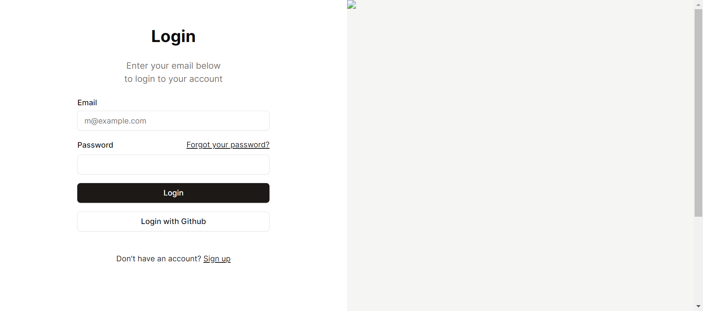
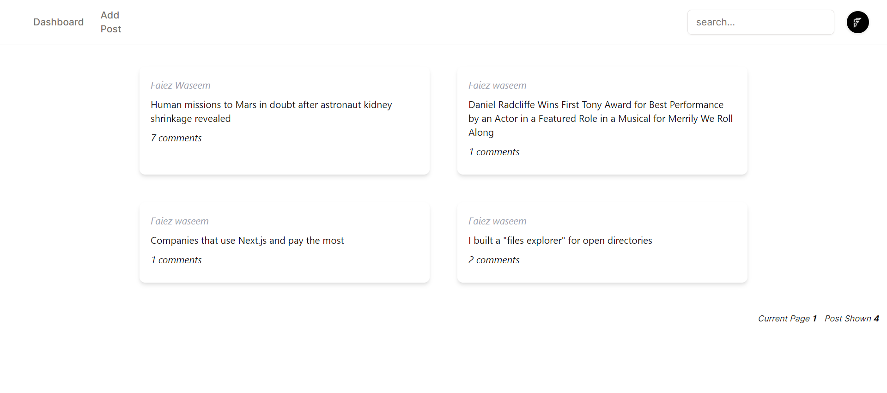
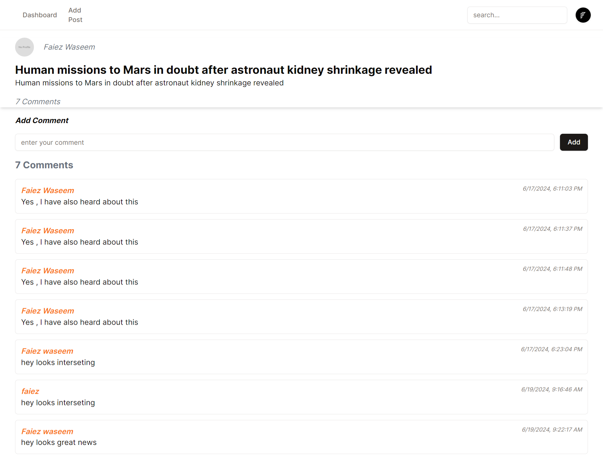

# (Nextjs + Tailwind + shcdcnui)  + (AdonisJS + Mysql)

### Versions 
- Nextjs 14.2.4
- React 18
- Adonisjs v6 ^6.9.0

Hi created a simple adonijs + Nextjs app router project, In this a user can login with Email/password or Github Login. then Authorized user can create posts and comment on posts. 
UI is not so great this was just a adonijs and nextjs together experiment.

# Screenshots

 

 

 
